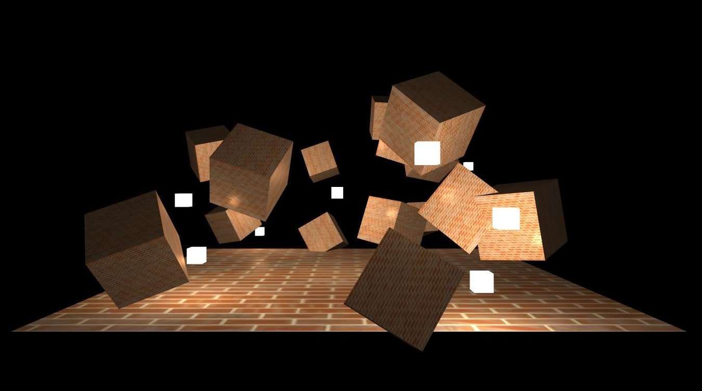

# WebGl Renderer
> Basic WebGL renderer build for learning computer graphics techniques.

## Table of contents
* [Showcase](#showcase)
* [Technologies](#technologies)
* [Setup](#setup)
* [Status](#status)

## Showcase

## Technologies
* JavaScript
* WebGL 1.0

## Setup
1. Deploy local server
2. Run MultipleLights.html file
3. Move around with arrow keys

## Features
* Multiple lights rendering
* Directional and point light
* Textures
* Basic model loading from obj file format
* Automatically setting shader attribute and uniform locations
* Perspective and ortographic projection

## Status
Project is finished.
